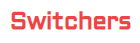

# Switchers


닌텐도 스위치 쇼핑몰 Switchers<br/>
https://switchers.vercel.app/

## Powered by


---

## 기술적 구현 포인트

### 1. MongoDB Aggregation Pipeline — 인기 순위 계산

인기 게임 Top 5를 DB에서 직접 집계합니다. `games` 컬렉션과 `reviews` 컬렉션을 `$lookup`으로 조인한 뒤, `$avg`로 평균 평점을 계산하고 정렬합니다.

```js
collection.aggregate([
  { $lookup: { from: "reviews", localField: "_id", foreignField: "gameId", as: "reviews" } },
  { $addFields: { score: { $round: [{ $avg: "$reviews.score" }, 2] } } },
  { $project: { reviews: 0 } },
]).sort({ score: -1 }).limit(5)
```

별도 `score` 필드를 DB에 저장하지 않고 **집계 시점에 동적으로 계산**하므로 리뷰가 추가돼도 자동으로 반영됩니다.

---

### 2. 게임 필터링 — POST + `$or` 쿼리

필터 조건을 배열로 전송해 MongoDB `$or` 연산자로 처리합니다. 체크박스 여러 개를 동시에 선택하면 해당 시리즈를 모두 포함한 결과를 반환합니다.

```ts
// 클라이언트: 선택된 필터를 조건 배열로 변환
const conditionList = checkedItems.map(name => ({ type: name }));

// 서버: $or로 처리
collection.find({ $or: conditionList })
```

GET 대신 **POST를 사용해 body에 필터 배열을 담는 방식**으로 복잡한 쿼리를 단순하게 처리합니다.

---

### 3. AbortController — 필터 변경 시 이전 요청 취소

필터를 빠르게 변경할 때 불필요한 이전 요청을 취소해 race condition을 방지합니다.

```ts
useEffect(() => {
  const controller = new AbortController();

  fetch("/api/games", { signal: controller.signal, ... })
    .then(res => res.json())
    .then(data => { if (!controller.signal.aborted) setGameList(data); });

  return () => controller.abort(); // cleanup 시 취소
}, [conditionList]);
```

---

### 4. Zustand — 장바구니 카운트 전역 동기화

Nav의 장바구니 뱃지와 각 상품 페이지의 "담기" 버튼이 Zustand 스토어로 연결돼 있습니다. 페이지 이동 없이 카운트가 즉시 반영됩니다.

```ts
const updateCartCount = useCartCountStore(state => state.updateCartCount);
updateCartCount(cartCount + 1); // 담기 성공 시 즉시 반영
```

---

### 5. NextAuth Credentials Provider + bcrypt

자체 이메일/비밀번호 인증을 구현했습니다. 비밀번호는 bcrypt로 해싱해 `users_cred` 컬렉션에 저장하고, NextAuth JWT 세션으로 관리합니다.

```ts
// 회원가입: bcrypt 해싱
const hash = await bcrypt.hash(password, Number(process.env.BCRYPT_SALT));

// 로그인: 비교
const isValid = await bcrypt.compare(password, user.password);
```

---

## Lighthouse 성능 개선 포인트

### `` → `next/image` 전환

Next.js `<Image>` 컴포넌트를 사용하면 자동으로 WebP 변환, lazy loading, 적절한 `srcset` 생성이 적용됩니다.

| 항목 | `` | `<Image />` |
|------|---------|-------------|
| 포맷 | 원본(jpg/png) | WebP 자동 변환 |
| 지연 로딩 | 수동 설정 필요 | 기본 적용 |
| 사이즈 최적화 | 없음 | 뷰포트에 맞는 크기 제공 |
| LCP 최적화 | 없음 | `priority` prop으로 preload |

이 프로젝트에서는 **15개 파일**의 `` 태그를 전부 `<Image />`로 교체하고, 첫 화면에 보이는 이미지(캐러셀, 상품 상세)에는 `priority` prop을 추가했습니다.

---

### `force-dynamic` — API 라우트 정적 프리렌더링 방지

Next.js 14는 빌드 시 `GET` 핸들러를 정적으로 프리렌더링하려 시도합니다. DB 연결이 필요한 API 라우트에 `export const dynamic = "force-dynamic"`을 선언해 런타임에만 실행되도록 합니다.

```ts
export const dynamic = "force-dynamic"; // 빌드 시 DB 접근 차단

export async function GET() {
  const db = (await connectDB).db("switchers");
  ...
}
```

---

### framer-motion 진입 애니메이션

상품 목록이 마운트될 때 `opacity: 0 → 1`, `translateY: -10 → 0` 트랜지션을 적용해 자연스러운 진입 효과를 줍니다. CSS transition 대신 framer-motion을 사용해 상태 기반 애니메이션을 선언적으로 작성합니다.

```tsx
<motion.div
  initial={{ opacity: 0, translateY: -10 }}
  animate={{ opacity: 1, translateY: 0 }}
  transition={{ duration: 0.5, ease: "easeInOut" }}
>
  <GameProductListItem gameInfo={gameInfo} />
</motion.div>
```
